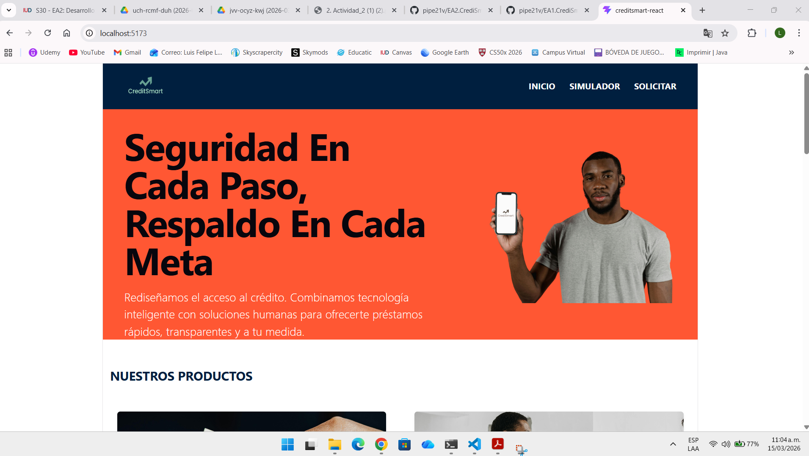
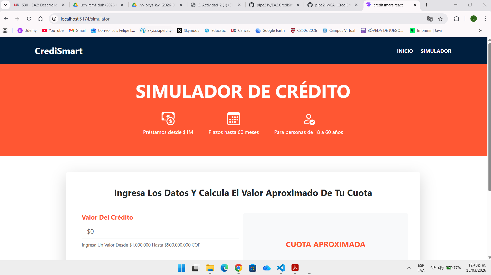

Credismart segunda parte proyecto Creditsmart, utilizando react+vite , nodeJs

Nombre: Luis Felipe Ladino Monsalve

Descripción del Proyecto
Desarrollo de Aplicación Web Dinámica con React donde ahora los datos se manejan mediante estado y los componentes son reutilizables.

Estructura de Archivos

## Capturas de Pantalla

